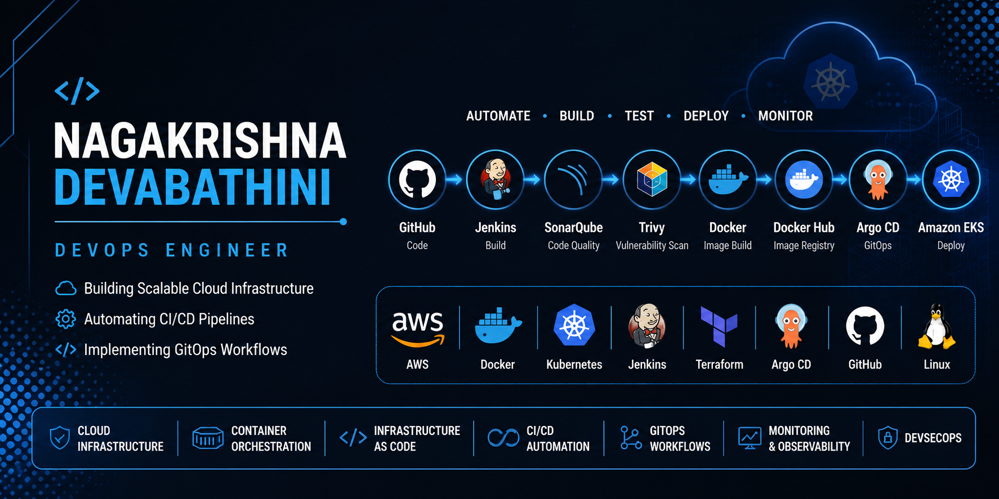

<p align="center">
  
</p>

<br>


<div align="center">

# Hi 👋 I'm Nagakrishna Devabathini

### 🚀 DevOps Engineer | AWS | Kubernetes | Docker | Jenkins | Terraform | Argo CD | GitOps


<p>
Building scalable cloud infrastructure, automating deployments, and implementing modern DevOps practices.
</p>

<p>
<a href="mailto:nagakrishnadevabathini@gmail.com">

</a>

<a href="https://www.linkedin.com/in/nagakrishna-devabathini-8676b1380/">

</a>

<a href="https://github.com/nagakrishnadevabathini-tech">

</a>

</p>

</div>

---

# 👨‍💻 About Me

💻 DevOps Engineer passionate about Cloud, Kubernetes, CI/CD and Infrastructure Automation.

☁️ Hands-on experience building **production-style DevOps pipelines** on AWS.

🚀 Skilled in designing scalable cloud infrastructure and GitOps workflows.

⚙️ Strong knowledge of Docker, Kubernetes, Jenkins, Terraform, Argo CD and AWS.

📈 Interested in Automation, DevSecOps and Cloud Native Technologies.

🎯 Currently looking for **DevOps Engineer opportunities**.

---

# 🛠️ Tech Stack

## ☁️ Cloud

<p>

</p>

AWS Services

- EC2
- VPC
- IAM
- EKS
- ALB
- Auto Scaling
- RDS
- CloudFormation

---

## 🐳 Containers & Kubernetes

<p>

</p>

- Docker
- Kubernetes
- Amazon EKS

---

## 🚀 CI/CD & GitOps

<p>

</p>

- Jenkins
- GitHub Actions
- Argo CD
- GitOps

---

## 🌍 Infrastructure as Code

<p>

</p>

- Terraform

---

## 🔒 DevSecOps

- SonarQube
- Trivy

---

## 💻 Operating System & Tools

| Category | Technologies |
|----------|--------------|
| 🖥️ Operating System | Linux (Ubuntu, Amazon Linux) |
| 📜 Scripting | Bash, Python |
| 🔀 Version Control | Git, GitHub |

## 📊 Monitoring

| Category | Technologies |
|----------|--------------|
| 📈 Monitoring | Prometheus, Grafana |

---

# 🚀 Featured Projects

## 🔥 End-to-End CI/CD GitOps Pipeline

Production-grade DevOps pipeline built using modern DevOps tools.

### Tech Stack

✅ GitHub

✅ Jenkins

✅ Maven

✅ SonarQube

✅ Trivy

✅ Docker

✅ Docker Hub

✅ Kubernetes

✅ Amazon EKS

✅ Argo CD

---

### Pipeline Flow

```text
GitHub
     │
     ▼
 Jenkins
     │
     ▼
 Maven Build
     │
     ▼
 SonarQube Analysis
     │
     ▼
 Trivy Scan
     │
     ▼
 Docker Build
     │
     ▼
 Docker Hub
     │
     ▼
 GitOps Repository
     │
     ▼
 Argo CD
     │
     ▼
 Amazon EKS
```

---

## ☸️ GitOps using Argo CD

✔ Declarative Kubernetes Deployments

✔ Automatic Synchronization

✔ Self-Healing

✔ Rollbacks

✔ Continuous Deployment

---

## ☁️ Kubernetes Voting Application

Production-style microservices deployment on Amazon EKS.

### Architecture

- Voting Application
- Result Application
- Worker Service
- Redis
- PostgreSQL

### Kubernetes Resources

- Deployments
- ReplicaSets
- Services
- LoadBalancer
- Configurations
- High Availability

---

## 🏗 AWS Three-Tier Architecture

Designed and deployed a secure three-tier architecture on AWS.

### AWS Services

- Amazon VPC
- Public & Private Subnets
- Internet Gateway
- NAT Gateway
- Bastion Host
- Application Load Balancer
- EC2
- Auto Scaling
- Amazon RDS
- Security Groups

---

## 🌍 Terraform Infrastructure Automation

Infrastructure as Code using Terraform.

### Features

✔ Modular Code

✔ Reusable Infrastructure

✔ Automated Provisioning

✔ State Management

✔ Resource Automation

---

# 📊 GitHub Stats

<p align="center">


</p>

<p align="center">


</p>

---

# 🎯 Professional Goals

- ☸️ Become a Certified Kubernetes Administrator (CKA)
- 🚀 Master GitHub Actions
- 📦 Learn Helm
- ⚙️ Learn Kubernetes Operators
- ☁️ Build Enterprise Cloud Infrastructure
- 🔒 Advance DevSecOps Skills
- 🌍 Contribute to Open Source Projects

---

# 📫 Connect With Me

<p align="center">

<a href="mailto:nagakrishnadevabathini@gmail.com">

</a>

<a href="https://www.linkedin.com/in/nagakrishna-devabathini">

</a>

<a href="https://github.com/nagakrishnadevabathini-tech">

</a>

</p>

---

<div align="center">

## 💡 Quote

### *"Automation is not replacing engineers; it empowers engineers to build better systems."*


⭐ If you like my work, consider giving a star to my repositories!

</div>
